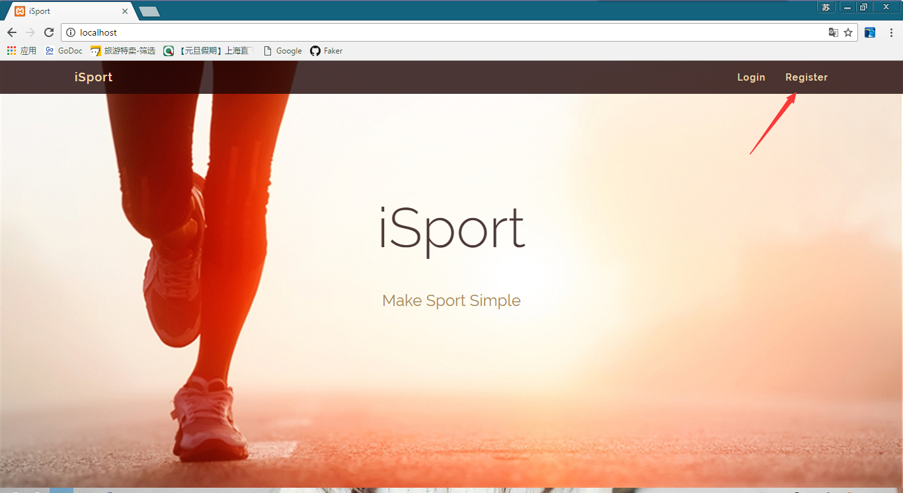
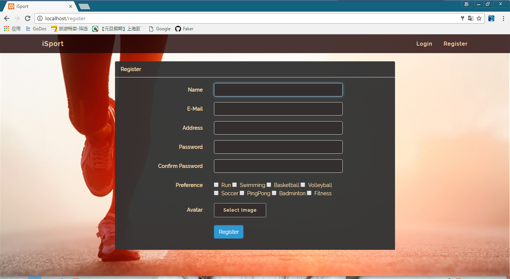
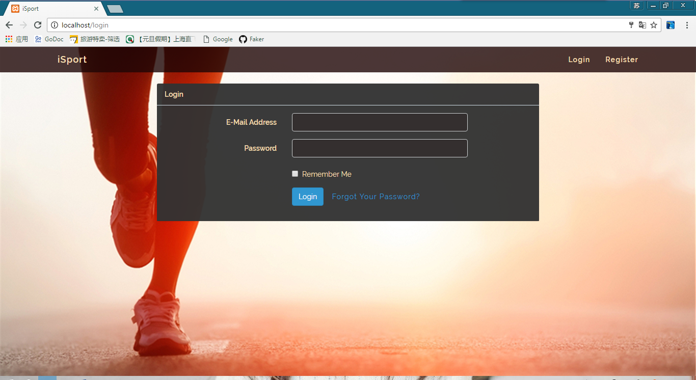
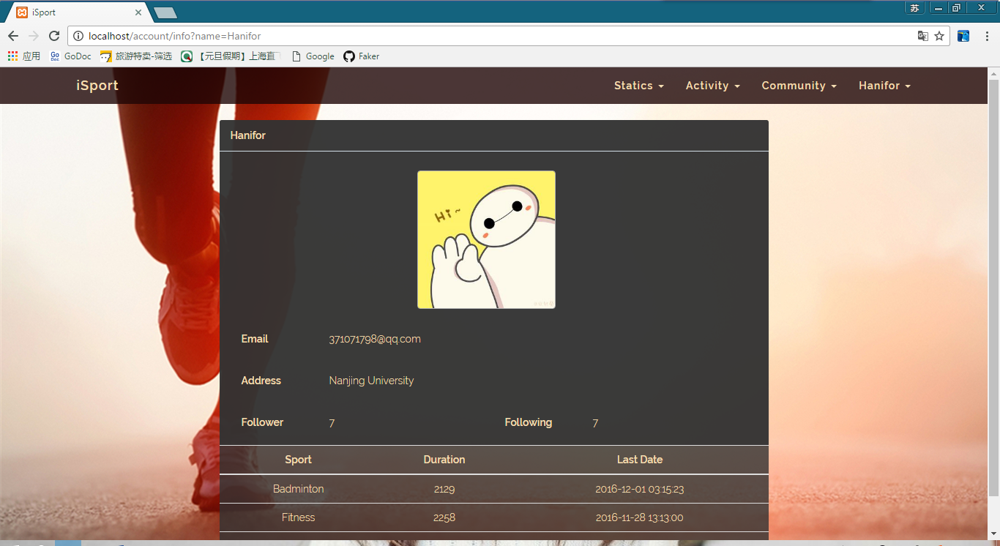
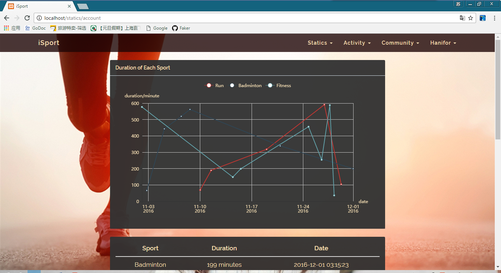
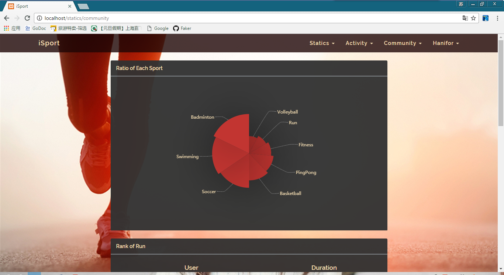
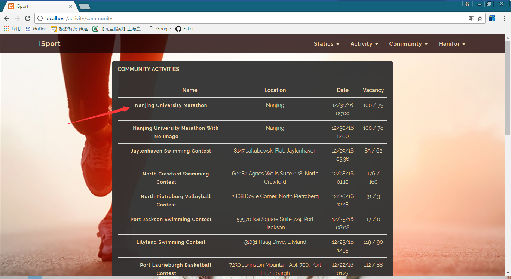
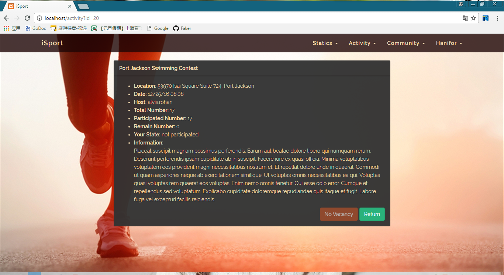
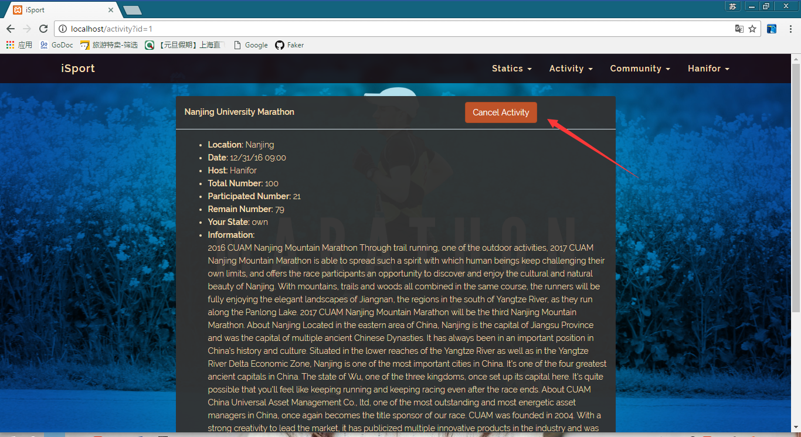
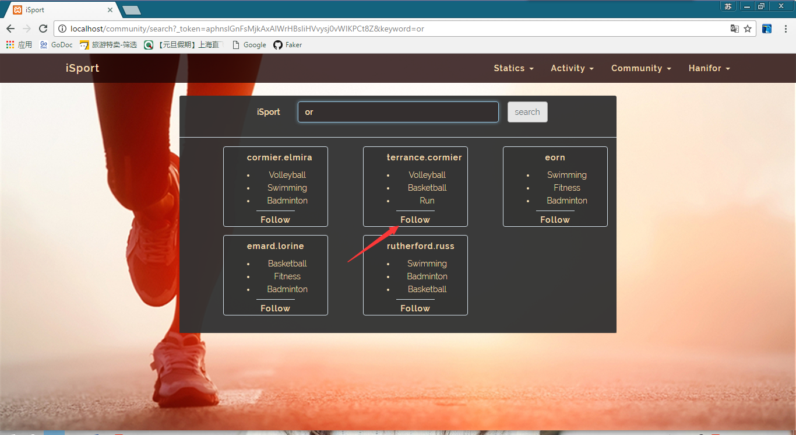

#iSport
A Sports Community Website
##Porject Introduction
This website is a practice to learn PHP. Moreover, Laravel, which is assumed as the most popular frame, is used to simplify the progress.
##Project Screenshot
####Home Page

####Registration Page

####Login Page

####User Information Page

####Statistics Analysis Page

####Community Activities Page

####Activity Information Page

####User Search Page

